<p align="center">
  <a href="https://open.mcd.cn/mcp" target="_blank">
    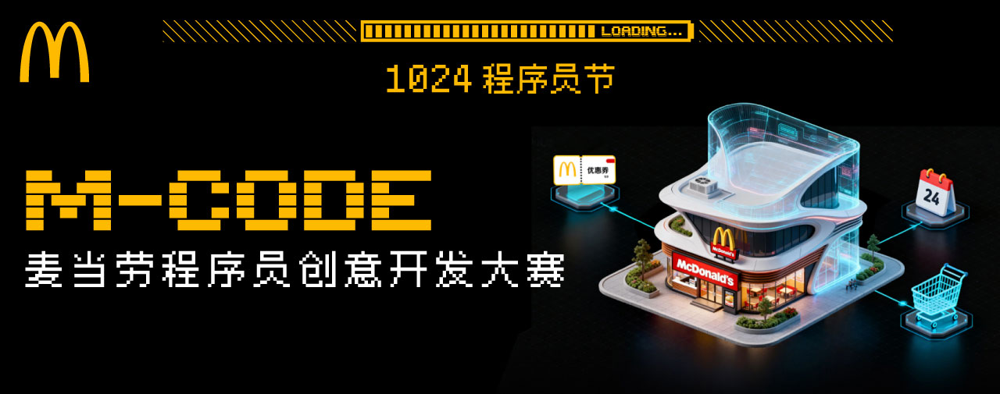
  </a>
</p>

# 介绍

## 本次活动是什么？

本次活动是麦当劳程序员创意开发大赛！

我们面向中国大陆地区的开发者发起邀请：基于麦当劳 MCP 能力，开发属于自己的 Skill，让创意真正解决现实问题，还有机会赢取程序员节专属好礼。

## 你可以开发什么？

套餐推荐助手、麦门省钱助手、麦麦活动推荐助手等。麦当劳 MCP 提供基础能力，你可以创造更多使用场景，开发兼具创意与实用价值的 Skill。

## 赛事时间

以下时间均为北京时间：

| 阶段 | 时间 |
|---|---|
| 报名及排名 | 2026年10月9日10:30—10月25日23:59 |
| 奖品兑换及信息提交截止时间 | 2026年11月14日 |
| 奖励发放 | 提交收货信息后约2周内 |

排名规则、赛事奖励及注意事项等，请参见 [activityGuidelines.md](./activityGuidelines.md)。

## 官方渠道说明

麦当劳 GitHub 官方账号及该账号下的本活动仓库是本活动的活动规则发布、报名和排行榜展示的官方渠道。与本活动相关的报名要求、资格审核、排行榜及公开发布的活动通知，均以麦当劳 GitHub 官方账号或该账号下的本活动仓库发布的信息为准。请注意识别信息发布账号及仓库来源，谨防虚假活动、非官方报名或兑奖链接。如有疑问，请查阅完整活动规则或按照活动规则载明的联系方式进行核实。

## 使用 WorkBuddy 开发 Skill

WorkBuddy 是本次活动的官方合作伙伴。我们推荐参赛者使用 WorkBuddy 开发 Skill，高效完成创意构思、开发与调试，有机会获得WorkBuddy积分奖励。立即访问 [WorkBuddy 官网](https://www.workbuddy.cn/?fromSource=gwzcw.22245487.22245487.22245487&utm_medium=cpc&utm_id=gwzcw.22245487.22245487.22245487)，开启你的 Skill 创作！

---

# 参与方式

## 注册 MCP

> 📖 MCP 使用指南：[麦当劳 MCP Server GitHub 使用指南](https://github.com/M-China/mcd-mcp-server)

- 第一步：点击右上角【登录】按钮

  <div class="img">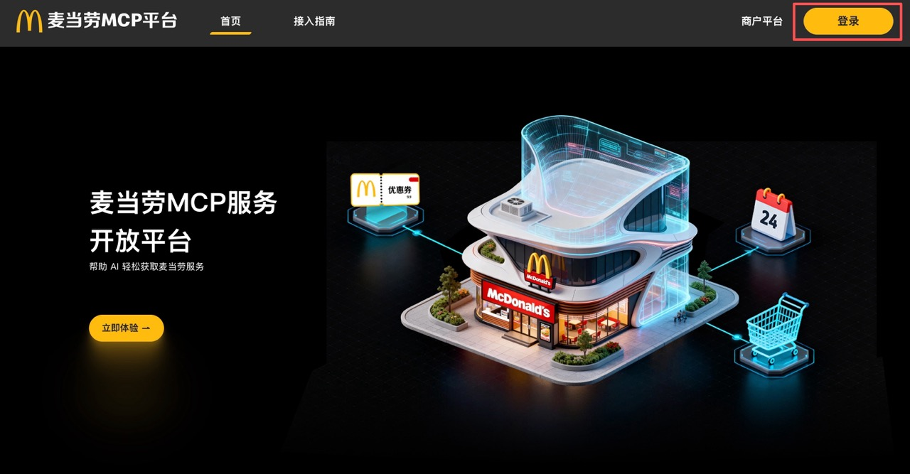</div>

- 第二步：跳转至登录页面，使用手机号完成验证登录

  <div class="img">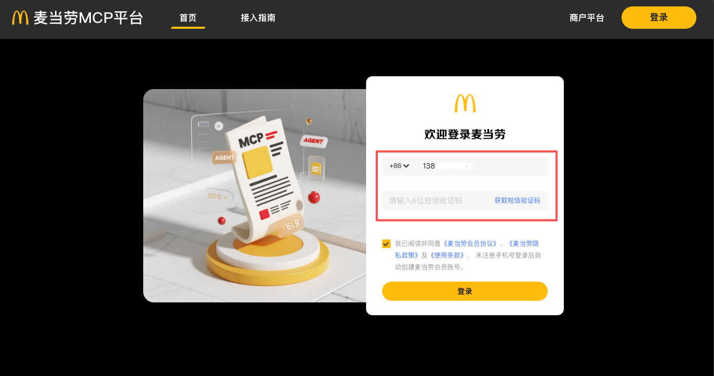</div>

  登录成功后将返回首页，右上角的“登录”按钮将变为“控制台”

  <div class="img">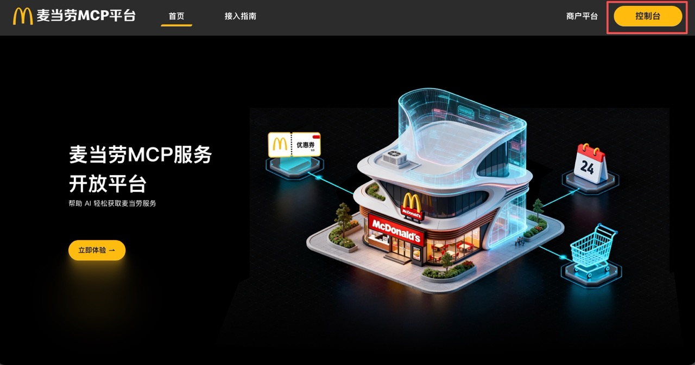</div>

- 第三步：申请 MCP Token

  点击右上角“控制台”，打开控制台弹窗。

  点击“激活”按钮，申请 MCP Token。

  <div class="img"></div>

- 第四步：阅读并同意服务协议

  <div class="img">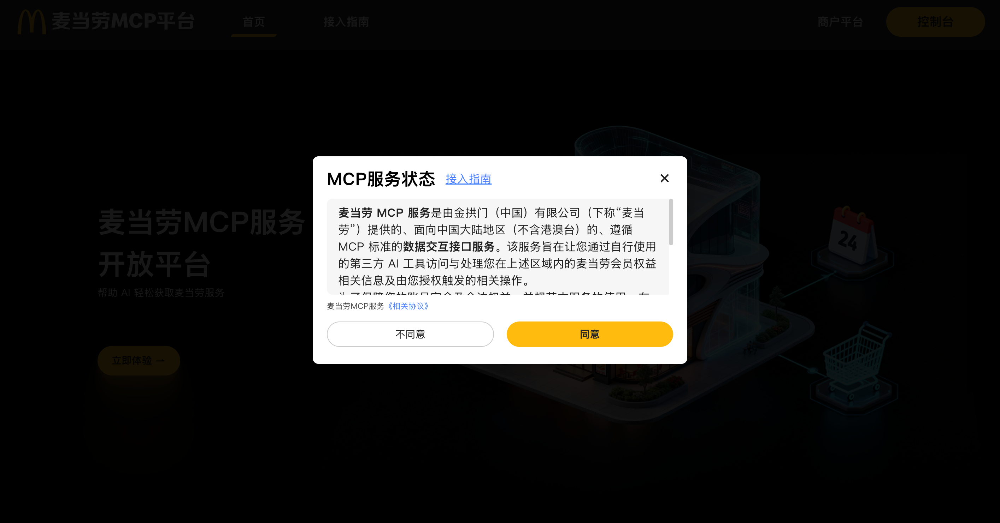</div>

- 第五步：MCP Token 申请成功后，可一键复制

  <div class="img">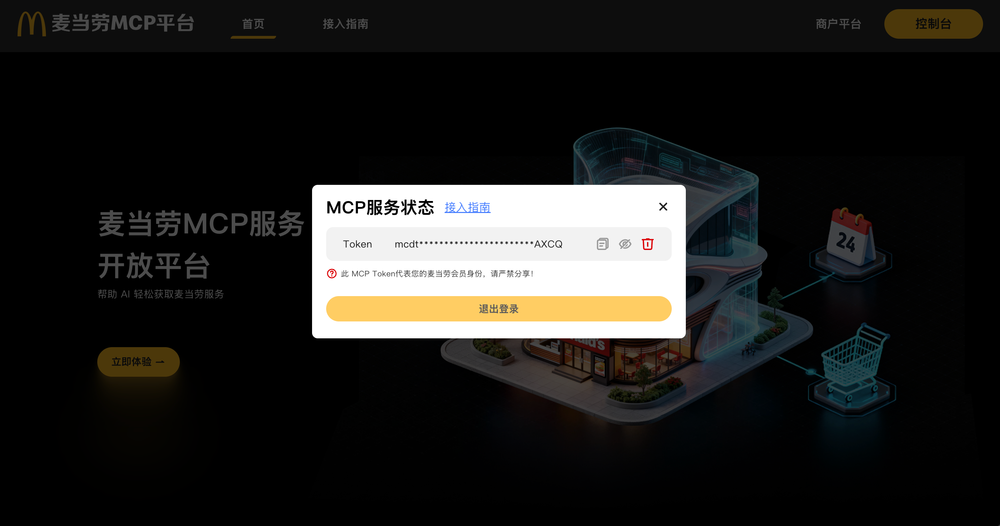</div>

## WorkBuddy 开发指南

- **前置条件：** 需申请到麦当劳中国的 MCP Token
- **参考文档：** [WorkBuddy 官方文档](https://www.workbuddy.cn/docs/workbuddy/From-Beginner-to-Expert-Guide/Function-Description/Connector)

1. 打开 WorkBuddy，在左侧边栏【专家·技能·连接器】，选中【连接器】页签
2. 点击右上角【自定义连接器】→【配置MCP】
3. 在打开的手动配置页面中填入以下 JSON 内容：

   ```json
   {
     "mcpServers": {
       "mcd-mcp": {
         "type": "streamablehttp",
         "url": "https://mcp.mcd.cn",
         "headers": {
           "Authorization": "Bearer YOUR_MCP_TOKEN"
         }
       }
     }
   }
   ```

   > ⚠️ **一定记得替换 `YOUR_MCP_TOKEN` 为实际 MCP Token，点击【保存】！**

4. 回到【自定义连接器】，将 mcd-mcp【启用】。接下来，即可在对话框中输入需求，让 AI 调用相应工具。

## 开发 Skill

参与者可以基于麦当劳现有的 MCP 能力，结合创意场景，开发具有创意或实用价值的 Skill 项目。为确保项目能够顺利报名，项目仓库应包含以下内容：

| 序号 | 文件名称 | 说明 | 是否必须 |
|:---:|---|---|---|
| 1 | README.md | 项目介绍、安装方法、使用示例和目标用户 | 必须，文件名不可改动 |
| 2 | [CONTEST_DECLARATION.md](./CONTEST_DECLARATION.md) | 参赛声明，包括原创性、合规性和敏感信息声明，防止项目被直接盗用 | **必须，文件名及内容均不可改动** |
| 3 | MCP_INTEGRATION.md | 说明实际使用的麦当劳 MCP Server、Tool、调用流程和业务价值 | 必须，文件名不可改动 |
| 4 | 源代码 | 项目主体代码或可运行内容 | 必须，形式不限 |
| 5 | workbuddy.md | 使用 WorkBuddy 开发时的对话上下文，用于核验是否符合联动活动奖励条件，可自行导出 | 非必须；参加 WorkBuddy 专项奖励时必须提交，文件名不可改动 |

> ⚠️ **重要：每个参赛项目必须包含 [`CONTEST_DECLARATION.md`](./CONTEST_DECLARATION.md)，且文件内容不可修改。建议参与者直接使用本官方项目提供的文件。**

## 将项目上传至 GitHub 并设为公开

> 后续文档截图均为示例。

<div class="img">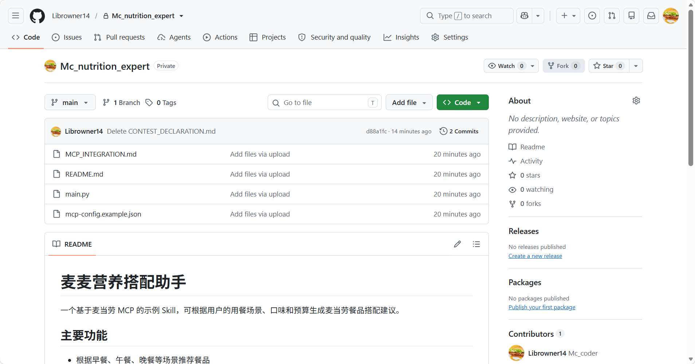</div>

## 通过 Issue 报名

按照标准格式，在活动项目下发布 Issue。格式如下：

```text
Issue 标题：自定义报名标题
Issue 正文：
【参赛申请】
项目名称：{项目名称}
项目地址：{项目 GitHub 仓库地址}
项目简介：{项目简介}
```
> **⚠️ 重要：由于报名 Issue 的校验逻辑较为严格，建议参赛者们注意以下情况：**
> - **项目的【简介标题】和【简介正文】之间暂不要使用换行符**
> - **项目地址链接暂不要使用 Markdown 格式组织文本**

<div class="img">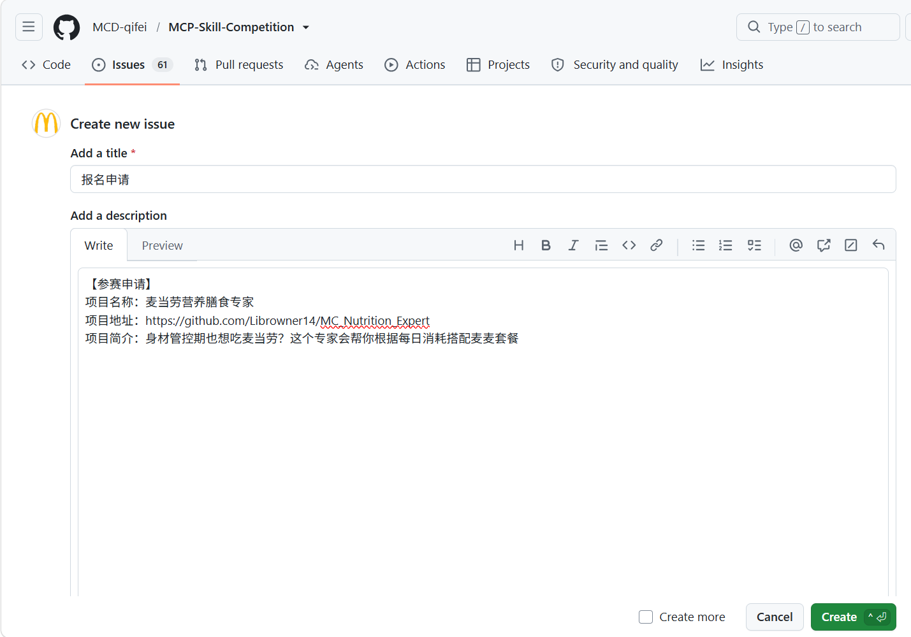</div>

### （1）报名条件

- 项目中包含规定的文件，且指定文件名符合要求
- 按照标准格式发布报名 Issue
- GitHub 项目为公开可访问的 Public 仓库
- 项目名称及项目内容不包含违法违规或敏感内容
- 项目创建时间为2025年12月25日00:00至2026年10月25日23:59

> 关于项目创建时间的说明：2025年12月25日是麦当劳 MCP 正式上线的日期。我们欢迎已有技术沉淀的优秀项目参与本次比赛，为广大开发者提供更多交流与学习的机会。

### （2）报名成功

报名成功后，系统将在报名 Issue 下回复成功通知。

<div class="img">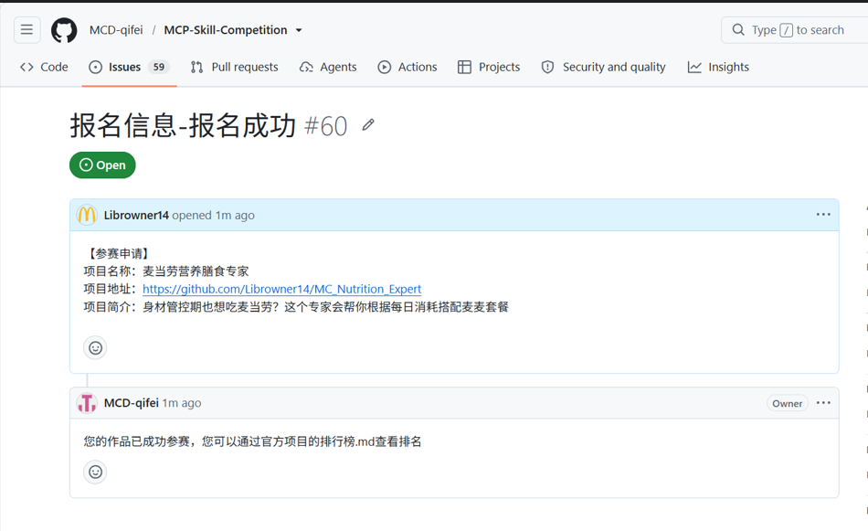</div>

### （3）报名失败后重新报名

如果因不满足条件导致报名失败，系统也会在报名 Issue 下回复失败原因。完成相应修改后，你可以重新提交 Issue。

<div class="img">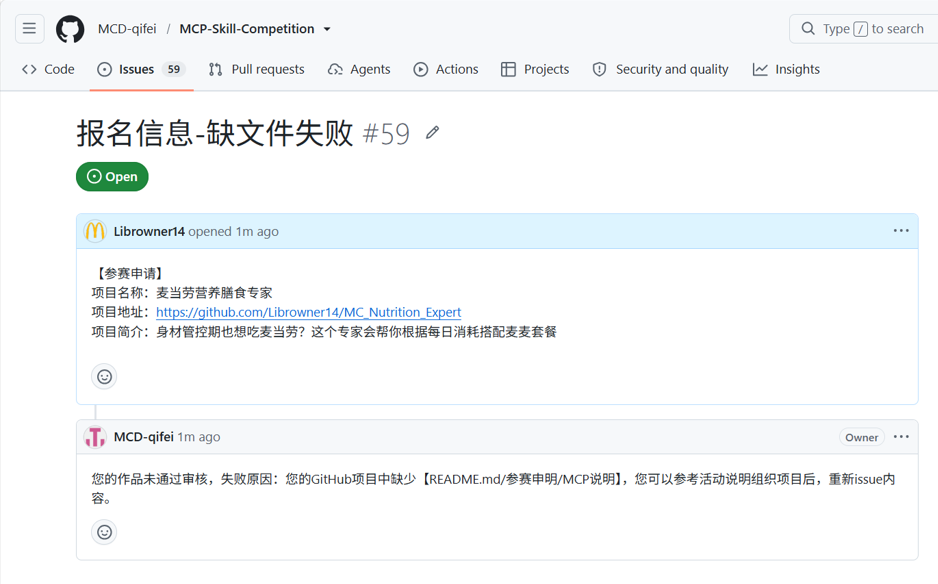</div>

## 项目排名

活动开始后，麦当劳将定时采集报名成功项目的**公开 Star 数据**。**Star 数大于0**的项目将按照排名规则进入排行榜，参赛者可在活动主项目的`RANKING.md`文件中查看项目排名。

- 排行榜仅展示排名前100的项目；如第100名存在多个Star数相同的项目，则所有并列项目均会展示。
- 全部报名成功的项目可在活动主项目的 [Issue 列表](https://github.com/M-China-Official/mcd-developer-innovation-challenge/issues)中查看。

<div class="img">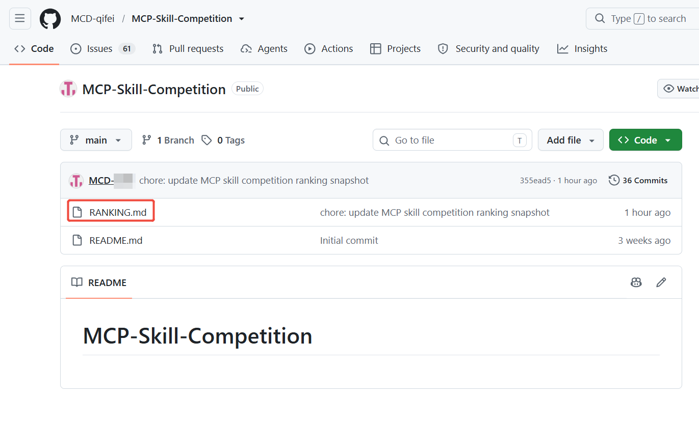</div>

<div class="img">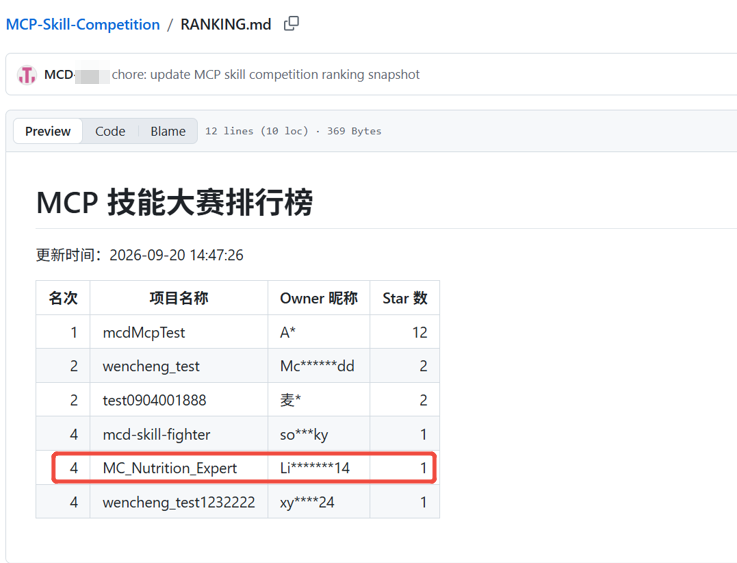</div>

### 定榜

活动于2026年10月25日23:59结束，并以2026年10月26日00:00采集的排行榜数据作为最终排名依据。原则上，排行榜前100个项目进入获奖范围；如第100个项目与后续项目的Star数相同，则所有同分项目均进入排行榜。

## 获奖通知与奖品发放

### （1）邮箱获取

麦当劳将尝试获取项目 Owner 的 GitHub 注册邮箱，用于发送获奖通知。若项目 Owner 已公开注册邮箱，麦当劳将直接读取公开邮箱；若注册邮箱未公开，麦当劳将通过 GitHub OAuth 授权机制发起授权申请，经项目 Owner 同意后读取其注册邮箱。

<div class="img">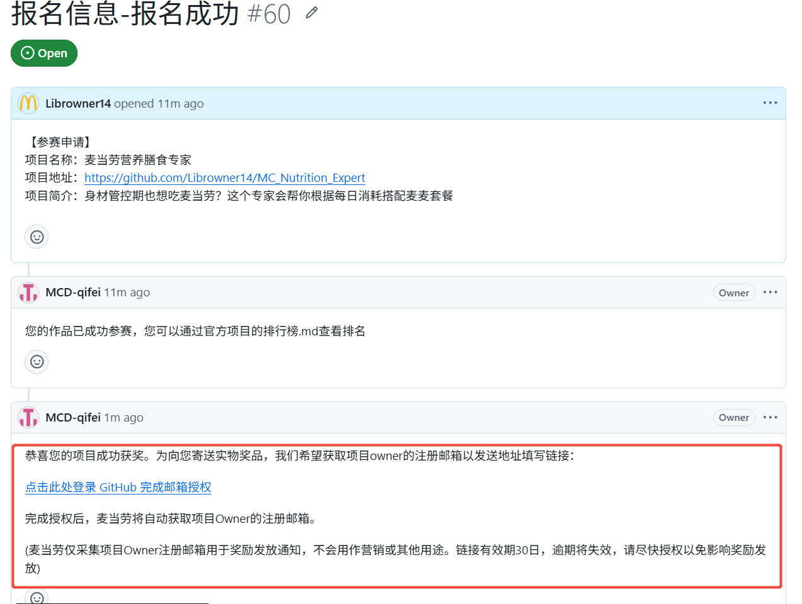</div>

<div class="img">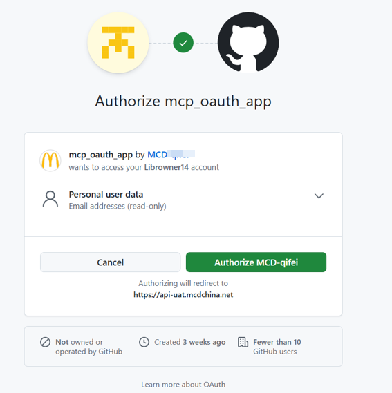</div>

### （2）问卷填写

获取邮箱后，我们将向该邮箱发送获奖通知及领奖信息收集问卷。问卷信息将用于发放实物奖品和电子奖励，请获奖者及时填写。

<div class="img">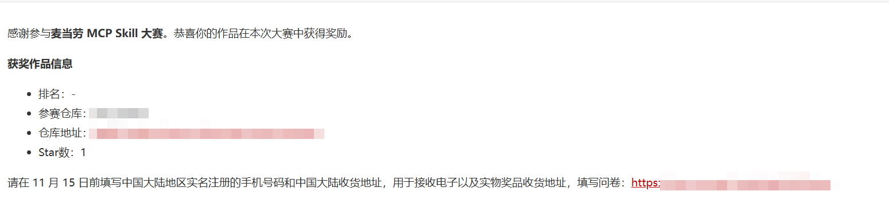</div>

### （3）实物奖励

进入排行榜的所有项目，每人还可获得以下实物周边，具体产品及包装以实物为准：

<p align="center">
  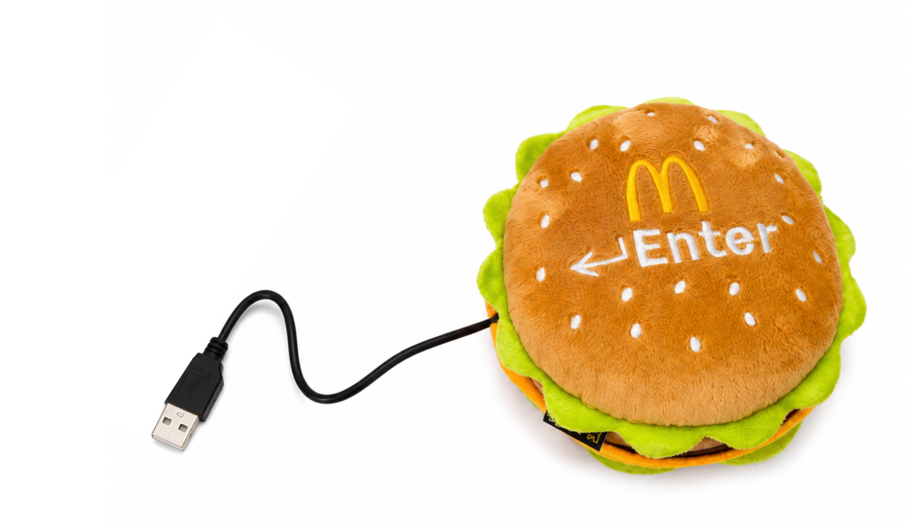
  
</p>

<p align="center">
  <strong>汉堡回车键玩具 × 1份　　程序员节实体徽章 × 1份</strong>
</p>

> 奖励机制具体以活动规则为准。

### （4）电子奖励兑换

前三名电子兑换券奖励：

- 第1名：巨无霸汉堡50次免费兑换券1张
- 第2名：巨无霸汉堡30次免费兑换券1张
- 第3名：巨无霸汉堡20次免费兑换券1张

WorkBuddy积分奖励：

- 排行榜前100名作品（含前三名）：提交`workbuddy.md`即可获得3,000积分
- 排行榜前3名：无论是否使用 WorkBuddy，均可获得10,240积分

> 奖励机制具体以活动规则为准。

### （5）其他

麦当劳有权在活动期间及活动结束后的获奖审核、奖品发放过程中对参赛者的身份信息、资格以及是否符合活动规则要求的其他条件进行合理核验。如发现不符合参与资格要求或存在违反活动规则的其他要求，麦当劳有权在不事先通知的情况下自行取消该参赛者的参赛资格、获奖资格及相关奖励，如给麦当劳造成损失的，麦当劳还有权进一步追究赔偿责任。
